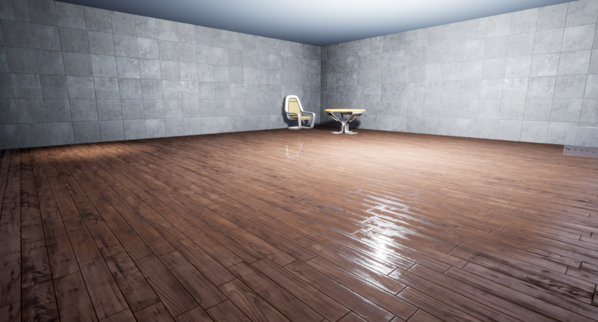
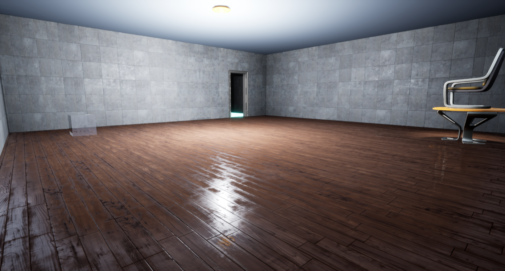
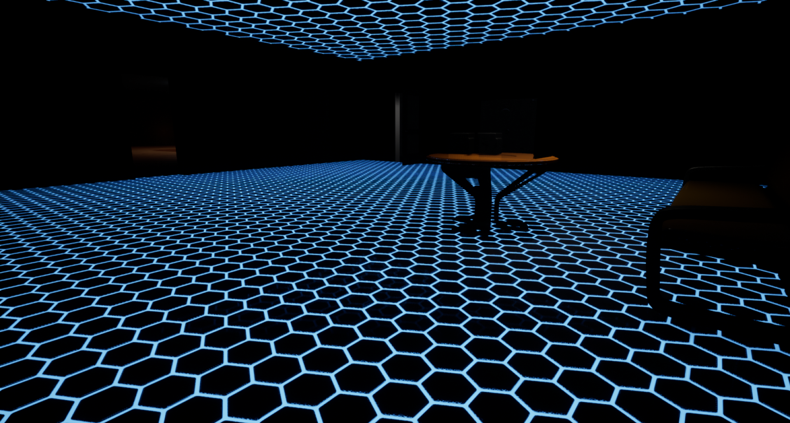
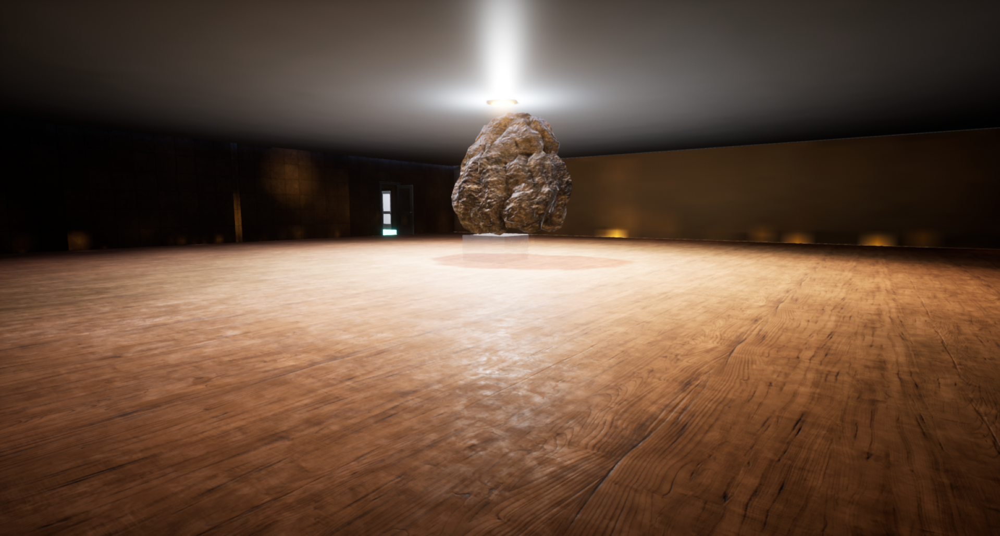
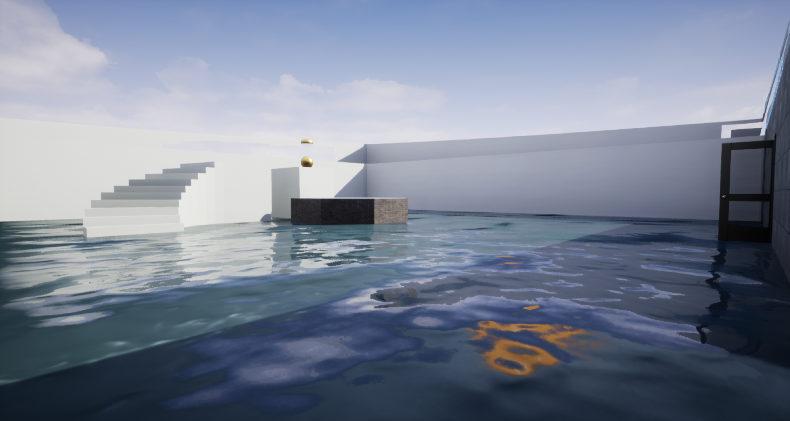

# Building Escape Game

### Overview

A game made using **Unreal Engine** and **C++**. The purpose of the game is for the player to escape the room by finding the pressure plate and placing objects onto the trigger volume. The game also includes door opening animations implemented using Unreals blueprint features.

Below are some screenshots of gameplay

